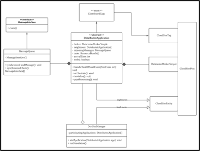

## Introduction

This is a final year project with the following project title:

"Simulating Distributed Consensus Algorithms among Applications using CloudSim Plus Framework"

The purpose of this project is to extend the current CloudSim Plus Framework to include support for running distributed consensus algorithms.

## Requirements

This project is a Maven project that uses Java 17. You can compile and run the code using the maven tool.
However, it is easier to use an IDE to run the code for you. IDE used to develop this project is INTELLIJ IDEA.

## Package structure

1. fazirul.fyp.elements

This package contains all the classes that extends the CloudSim Plus Framework. 
Users intending to implement your own distributed algorithm should only take a look at the DistributedApplication class.
The UML class diagram is shown below.

2.fazirul.fyp.basic

This package is a basic example on how to implement your own distributed algorithm and run the simulation. It consists of one main class to run the code, 
and one BasicApplication class that implements the DistributedApplication. 

3. fazirul.fyp.dragon

This package contains the classes that implements the [DRAGON paper](https://github.com/netgroup-polito/dragon). 
A DRAGON device is represented by the EdgeDeviceDragon class.

This package also defined the custom GoogleTraceReader that extends the CloudSim Plus' implementation, to be able to create EdgeDeviceDragon objects
from the Google trace data.
